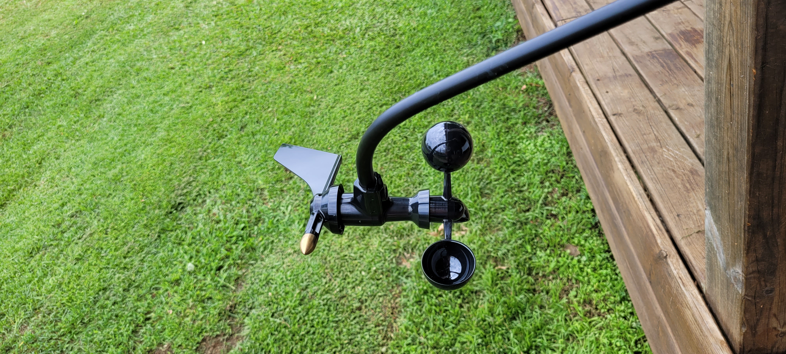
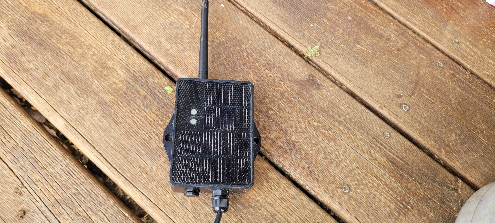
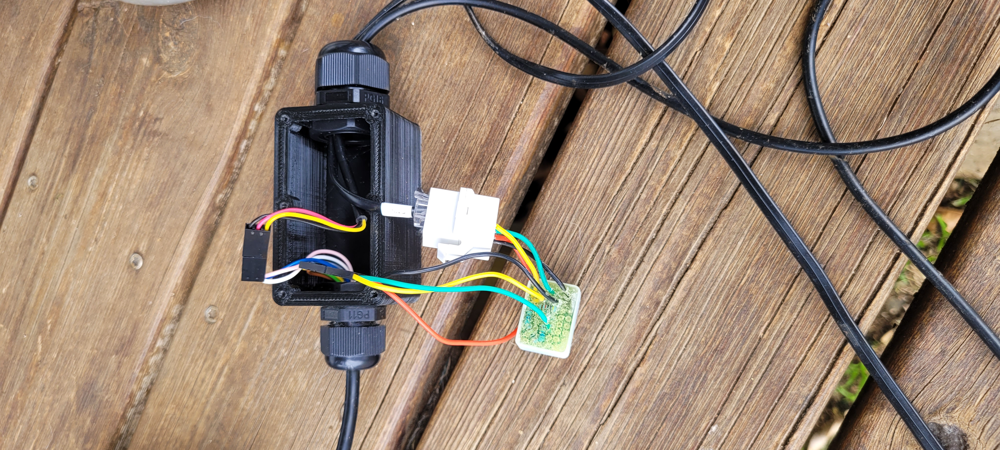
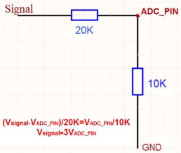

# La balise météo du phare de vieux-Fort en Guadeloupe

Nous sommes André (l' "installateur"), Yves (le "chef de projet"), Franck (le "data engineer") et Noël (le Potomitan du phare), quatre pratiquants de wingfoil réguliers (et plus si jeunes) du spot. Vous nous avez sans doute croisés si vous fréquentez le lieu pour naviguer, plonger, sauter, bronzer, pique-niquer... dans cet endroit magnifique.

Avec le support de Thierry pour la partie "electronique", nous sommes à l'origine de l'installation de ce matériel qui a été mis en place avec une approche "DIY" et communautaire.

Vous trouverez ici le processus d'installation de cette borne, afin que vous puissiez la répliquer. Nous vous y encourageons.

## Choix des technologies

### Le matériel 

La borne est destinée a être installée sur la galerie au sommet du phare de Vieux-Fort. Ainsi il est primordial qu'elle soit la plus robuste et la plus autonome possible. En effet toute intervention necessiera une synchronisation avec le personnel des phares & balises. Par ailleurs, la borne ne pourra pas puiser son énergie au niveau des installations électriques du phare, il faut donc qu'elle soit autonome en énergie.

Basiquement, nous devons arbitrer entre 2 technologies :

1. Un montage communiquant sur un réseau haut-débit (GSM 4G/5G)
    * Avantages : Réseau autonome. Transmission des données à haute fréquence. Possibilité d'équiper la borne d'une caméra.
    * Inconvénients : technologie gourmande en énergie. Nécessité de mettre en place une recharge solaire (relativement) conséquente.
2. Un montage communiquant sur un réseau bas-débit (LORA ou SigFOX)
    * Avantages : Très économe en énergie, autonomie théorique de plusieurs années.
    * Inconvénients : Nécessité d'integrer un point d'accès à Internet. Webcam pas ensisageable.

Le point de l'énergie étant prédominant, c'est sur une installation Lora que le choix s'est porté. C'est Yves, qui vit a quelques centaines de mètres à vol d'oiseau qui hebergera la passerelle Internet.

### Le logiciel

Les choix suivants s'offraient a nous :

1. Mettre en place une stack complete "Internet Of Things" complete avec un broker MQTT et un site web autonome abonné à ce broker et chargé d'exposer les données météo
2. Centraliser le traitement des données au niveau de la gateway Lora et s'appuyer sur un service à la "WindGuru" pour présenter les données.

Par souçi de simplicité, c'est l'option 2. qui a été choisie. Néanmoins, afin d'assurer une redondance, la borne sera intégrée à 2 services tiers : WindGuru et OpenWindMap

## Raccordement des matériels

La borne se compose des éléments suivants :

| Item | Lien | Prix | Doc |
|:---:|:---:|:---:|:---:|
| Anémométre Davis 6410 |  [Fiche produit](https://www.davis-meteo.com/6410.php) | ??€ | [Manuel](https://www.meteo-shopping.com/fr/capteurs/109-anemometre-girouette-vantage-pro.html) |
| Boitier émétteur Dragino SN50v3-LB/LS | [Fiche produit](https://www.dragino.com/products/lora-lorawan-end-node/item/260-sn50v3-lb-ls.html)| ??€ | [Manuel](https://wiki.dragino.com/xwiki/bin/view/Main/User%20Manual%20for%20LoRaWAN%20End%20Nodes/SN50v3-LB/)|
| Gateway Lora Dragino LPS8v2 | [Fiche produit](https://www.dragino.com/products/lora-lorawan-gateway/item/228-lps8v2.html) | ??€ | [Manuel](https://wiki.dragino.com/xwiki/bin/view/Main/User%20Manual%20for%20All%20Gateway%20models/HP0C/) |
| Capteur de température ?? | ? | ?? €| ?? |
| Divers: Mât etc | ?| ??€ | ?? |

### Raccordement des éléments

La girouette/anemometre Davis est cablée avec un connecteur RJ11 male. Le capteur de température est cablé avec une fiche Dupont 3pin male.

La tension de sortie de la girouette varie entre 1V et 3V. La tension d'entrée du senseur ADC de l'emetteur doit varier entre 0.1V et 1.1V. Il faut donc mettre en oeuvre un pont de resistances afin d'adapter le voltage

Principe :

Schema de branchement :

Le montage de resistances est pris dans de la résine coulée dans un petit boitier

Une prise RJ11 femelle est reliée a l'emetteur selon ce schema :
* Connecteur 1 (couleur?) vers entrée ?? de l'emetteur
* Connecteur 2 (couleur?) vers entrée ?? de l'emetteur
* Connecteur 3 (couleur?) vers entrée ?? de l'emetteur
* Connecteur 4 (couleur?) vers entrée ?? de l'emetteur

Une prise Dupont 3pin femelle
* Connecteur 1 (couleur?) vers entrée ?? de l'emetteur
* Connecteur 2 (couleur?) vers entrée ?? de l'emetteur
* Connecteur 3 (couleur?) vers entrée ?? de l'emetteur

L'ensemble des connections est contenu dans un boitier imprimé en 3D dont voici le STL : 

### Paramétrage de l'emetteur

L'emetteur sera réglé sur son Mode 6

Procédure AT ....

### Appairage de la passerelle à l'emetteur

## Mise en oeuvre logicielle

Une fois la passerelle Lora branchée sur un routeur internet, celui-ci lui affecte une IP DHCP, par exemple 192.168.1.20
Un acces à http:192.168.1.20 permet d'afficher l'interface d'administration de la passerelle

 

