# La balise météo du phare de Vieux-Fort en Guadeloupe

Nous sommes André ("l'électricien"), Yves ("le chef de projet"), Franck ("le data engineer") et Noël (le Potomitan du phare), quatre pratiquants de wingfoil réguliers (pas des plus jeunes) du spot. Vous nous avez sans doute croisés si vous fréquentez le lieu pour naviguer, plonger, sauter, bronzer, pique-niquer... dans cet endroit magnifique.

Avec le support de Thierry pour la partie "électronique", nous sommes à l'origine de l'installation de ce matériel qui a été mis en place avec une approche "DIY" et communautaire.

Vous trouverez ici le processus d'installation de cette borne, afin que vous puissiez la répliquer. Nous vous y encourageons.

## Choix des technologies

### Le matériel

La borne est destinée a être installée sur la galerie au sommet du phare de Vieux-Fort. Ainsi il est primordial qu'elle soit la plus robuste et la plus autonome possible. En effet toute intervention nécessitera une synchronisation avec le personnel des phares & balises. Par ailleurs, la borne ne pourra pas puiser son énergie au niveau des installations électriques du phare, il faut donc qu'elle soit autonome en énergie.

Basiquement, nous devions arbitrer entre 2 technologies :

1. Un montage communiquant sur un réseau haut-débit (GSM 4G/5G)
   * Avantages : Réseau autonome. Transmission des données à haute fréquence. Possibilité d'équiper la borne d'une caméra.
   * Inconvénients : technologie gourmande en énergie. Nécessité de mettre en place une recharge solaire (relativement) conséquente.
2. Un montage communiquant sur un réseau bas-débit (LORA ou SigFOX)
   * Avantages : Très économe en énergie, autonomie théorique de plusieurs années.
   * Inconvénients : Nécessité d'intégrer un point d'accès à Internet. Webcam pas envisageable.

Le point de l'énergie étant prédominant, c'est sur une installation Lora que le choix s'est porté. C'est Yves, qui vit à quelques centaines de mètres à vol d'oiseau qui hébergera la passerelle Internet.

### Le logiciel

Les choix suivants s'offraient a nous :

1. Mettre en place une stack "Internet Of Things" complète avec un broker MQTT et un site web autonome abonné à ce broker et chargé d'exposer les données météo
2. Centraliser le traitement des données au niveau de la gateway Lora et s'appuyer sur un service à la "WindGuru" pour présenter les données.

Par souci de simplicité, c'est l'option 2. qui a été choisie. Néanmoins, afin d'assurer une redondance, la borne sera intégrée à 2 services tiers : WindGuru et OpenWindMap

## Raccordement des matériels

La borne se compose des éléments suivants :


|                  Item                  |                                                Lien                                                |            Prix            |                                                      Doc                                                      |
| :-------------------------------------: | :------------------------------------------------------------------------------------------------: | :------------------------: | :-----------------------------------------------------------------------------------------------------------: |
|         Anémomètre Davis 6410         |                       [Fiche produit](https://github.com/flefebure/meteo-le-phare-vieux-fort/blob/0f8d7a7ca1cc759bb87fbd7ad5027cff3bb662dc/medias/6410_An%C3%A9mom%C3%A8tre_FICHE%20PRODUIT_FR_DAVIS-1.pdf)                       |           ~245€           |        [Manuel](https://www.meteo-shopping.com/fr/capteurs/109-anemometre-girouette-vantage-pro.html)        |
| Boitier émetteur Dragino SN50v3-LS   | [Fiche produit](https://www.dragino.com/products/lora-lorawan-end-node/item/260-sn50v3-lb-ls.html) |           ~60€           | [Manuel](https://wiki-old.dragino.com/xwiki/bin/view/Main/User%20Manual%20for%20LoRaWAN%20End%20Nodes/SN50v3-LB/) |
|       Gateway Lora Dragino LPS8v2       |    [Fiche produit](https://www.dragino.com/products/lora-lorawan-gateway/item/228-lps8v2.html)    | 190 à 260€ suivant model |   [Manuel](https://wiki-old.dragino.com/xwiki/bin/view/Main/User%20Manual%20for%20All%20Gateway%20models/HP0C/)   |
|     Capteur de température DS18B20     | [Fiche produit](https://www.amazon.fr/DS18B20/s?k=DS18B20) |           ~3 €           |         [Datasheet](https://www.analog.com/media/en/technical-documentation/data-sheets/ds18b20.pdf)         |
|            Divers : Mât etc.            |                                                 ?                                                 |            ??€            |                                                      ??                                                      |

Le boitier émetteur Dragino SN50v3-LB/LS existe en 2 versions :
*	SN50v3-LB qui fonctionne sur pile Li/SOCl2 de 8500mAh d'une durée d’environ 3-5 ans (suivant consommation des capteurs)
*	SN50v3-LS qui fonctionne sur panneau solaire + batterie lithium ion

La version SN50v3-LS a été choisi car elle évite la maintenance d’un changement de batterie.

### Raccordement des éléments

La girouette/anémomètre Davis est câblée avec un connecteur RJ11 male. Le capteur de température est câblé avec une fiche Dupont 3pin male.

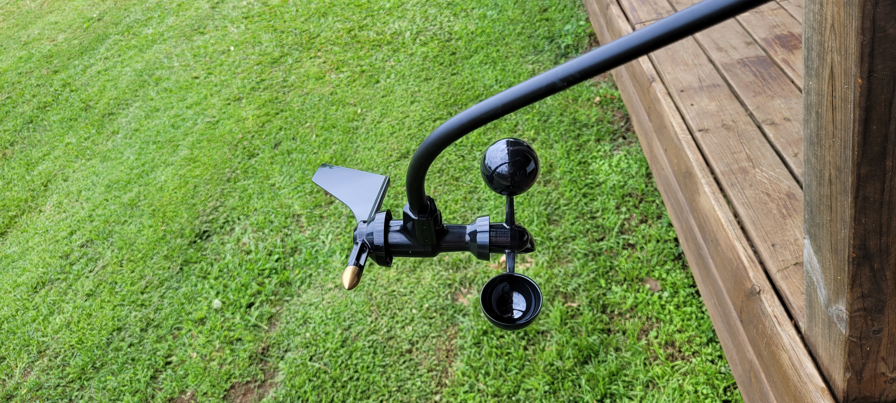
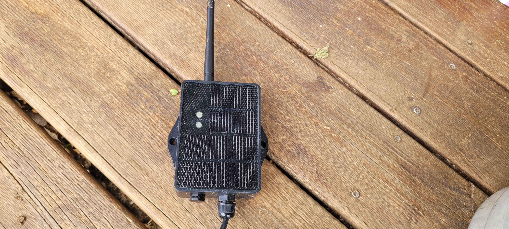
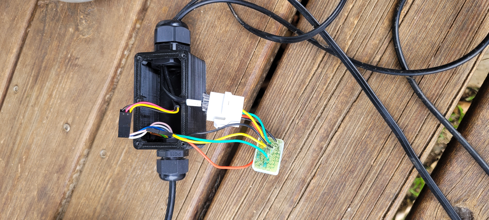

La tension de sortie de la girouette varie entre 0V et la tension d'alimentation du boitier émetteur Vdd soit 3.3V. La tension d'entrée du convertisseur ADC de l'émetteur doit être comprise entre 0.1V et 1.1V. Il faut donc mettre en œuvre un pont de résistances afin d'adapter le voltage

Principe :

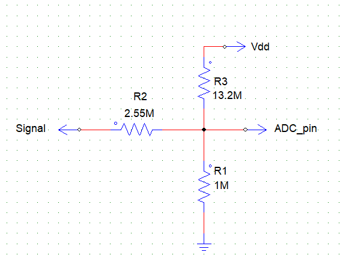

Schema de branchement :

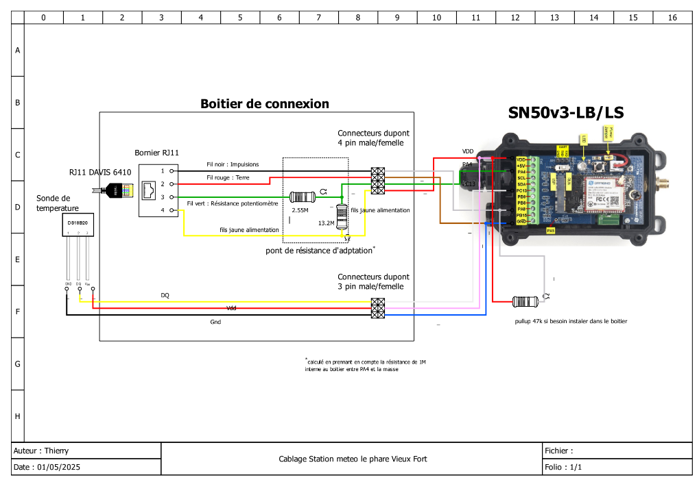

NB:

* Le circuit des résistances est pris dans de la résine coulée dans un petit boitier
* L'ensemble des connections est contenu dans un boitier imprimé en 3D avec du PETG comportant 2 passe-câble avec presse-étoupes en plastique étanche PG11 et PG13.5. Les presse-étoupes ont un diamètre interne de 11 mm et 13.5 mm pour pouvoir insérer les câbles avec leur connecteur. Enfin des bagues d’étanchéité sont imprimée en TPU pour adapter le diamètre des câbles au presse étoupe. Les différent fichiers STL sont disponible ci-dessous :
  * [Bague étanche diamètre 10](medias/bague%20etanche%20d10.5_d5mm.stl)
  * [Bague étanche diamètre 13](medias/bague%20etanche%20d13.5_d4mm.stl)
  * [Haut du boitier](medias/boitier%20connexion%20haut.stl)
  * [Bas du boitier](medias/boitier%20connexion%20bas.stl)

La sonde de température est la classique DS18B20:

 * 
   
 celle-ci est installé dans un écran radiatif qui est une adaptation/mise à l'échelle de [Radiation Shield For Weather Station Temperature/Humidity](https://www.thingiverse.com/thing:1067700):
 
  

L'écran radiatif est imprimé en PETG blanc. Les différents fichiers STL sont disponible ci-dessous :
  * [Support écran](medias/Rad_Shd_Vert_mount_60%25.stl)
  * [porte sonde](medias/Rad_Shd_Porte_sonde_60%25.stl)
  * [Aillete intermédiare x4](medias/Rad_Shd_ailette_60%25.stl)
  * [Ailette supérieur](medias/Rad_Shd_ailette_superieur_60%25.stl)
  * [écran radiatif complet monté](medias/Rad_Shd_Vert_mount_complet_V3_60%25.stl)

L'ensemble des pieces sont relier/empilé entre elle par 3 vis d3mm*60mm qui se visse dans l'ailette supérieur (tarauder les trous avant montage)


### Paramétrage de l'émetteur

Le boitier émetteur Dragino SN50v3-LB/LS est un boitier multi usage qui demande à être configuré en fonction de l’application et des capteurs qui seront connecté dessus. La documentation propose différent mode : [Mode boitier](https://wiki-old.dragino.com/xwiki/bin/view/Main/User%20Manual%20for%20LoRaWAN%20End%20Nodes/SN50v3-LB/#H2.3.2WorkingModes26SensorData.UplinkviaFPORT3D2)

Dans notre cas nous allons utiliser le mode comptage : Mode 6, car nous avons à compter les tours de rotation de l’anémomètre, mesurer le potentiomètre de la girouette et mesurer la température.
Le boitier SN50v3-LB/LS prend en charge les méthodes de configuration suivante :
* Commande AT via connexion Bluetooth (recommandée): [BLE Configure Instruction](https://wiki-old.dragino.com/xwiki/bin/view/Main/BLE%20Bluetooth%20Remote%20Configure/).
* Commande AT via connexion UART voir : [UART Connection](https://wiki-old.dragino.com/xwiki/bin/view/Main/UART%20Access%20for%20LoRa%20ST%20v4%20base%20model/#H2.3UARTConnectionforSN50v3basemotherboard).
* Par liaison descendante LoRaWAN.  Voir instruction : [IoT LoRaWAN Server section](https://wiki-old.dragino.com/xwiki/bin/view/Main/).

La méthode « Commande AT via connexion Bluetooth » a été utilisé :

Après installation sur un téléphone Android de l'utilitaire dragino "Devices.Toll" les commandes AT nécessaire à la configuration souhaitée ont été envoyé :

* Commande de passage en mode 6 : AT+MOD=6
* Définition de la période de transmission en ms : AT+TDC=30000 (30000ms= 30s)


### Configuration du réseau Lorawann de la passerelle utilisé par l'émetteur

La passerelle permet de configurer l'accés à un réseau Lorawann comme par exemple [The Things Network V3](https://www.thethingsnetwork.org/) ou d'utiliser le réseau lorawan local à la passerelle. Dans notre cas nous avons utilisé le réseau local "Chirpstack". les informations de configuration sont à retrouver dans Manuel utilisateur de la Gateway Lora Dragino LPS8v2 : [Manuel](https://wiki-old.dragino.com/xwiki/bin/view/Main/User%20Manual%20for%20All%20Gateway%20models/HP0C/)

## Mise en œuvre logicielle

### administration passerelle

Une fois la passerelle Lora branchée sur un routeur internet, celui-ci lui affecte une IP DHCP, par exemple 192.168.1.20
Un acces à http://192.168.1.20 permet d'afficher l'interface d'administration de la passerelle
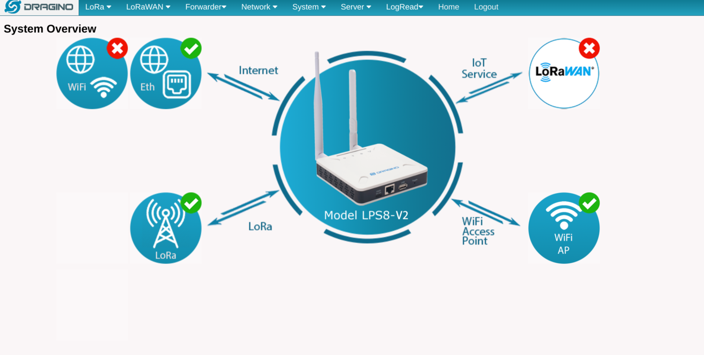

Cette interface est surtout utilse pour vérifier que la paserelle est bien connectée à l'émetteur et peut accéder à Internet. La majeure partie des configurations s'effectue via l'utilitaire "Chirpstack" qui est disponible a l'adresse http://192.168.1.20:8080

### Chirpstack

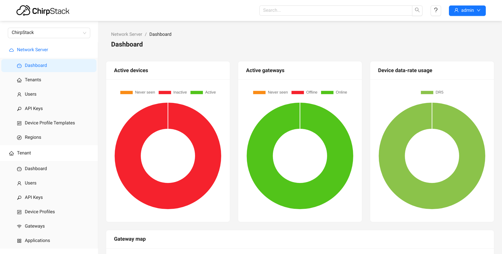

La premiere tâche est de créer un template pour l'émetteur 
Voici notre configuration :

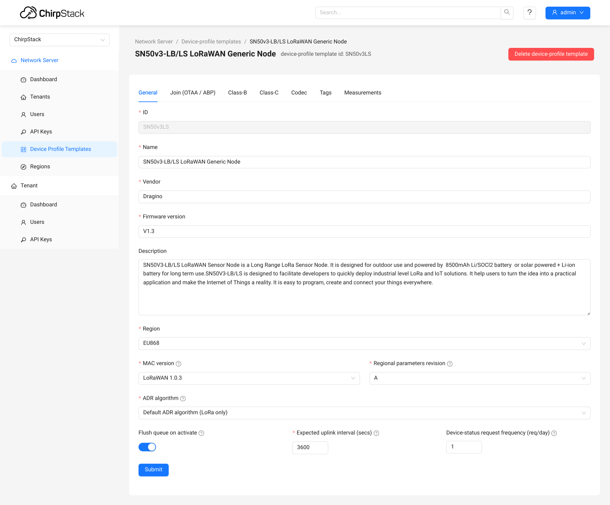

Il faut ensuite définir un template, en effet l'émetteur Lora envoie ses données sous forme de trames hexadécimales, le codec va permettre de convertir la charge utile de ces trames en informations utilisables, par exemple la température ou le nombre de rotations de l'anémomètre. 
Le wiki de Dragino vous propose un Codec à utiliser

[Codec](https://github.com/dragino/dragino-end-node-decoder/blob/main/SN50_v3-LB/SN50_v3-LB_ChirpstackV4_decode.txt)

Collez simplement le contenu de ce fichier dans la partie Codec du template

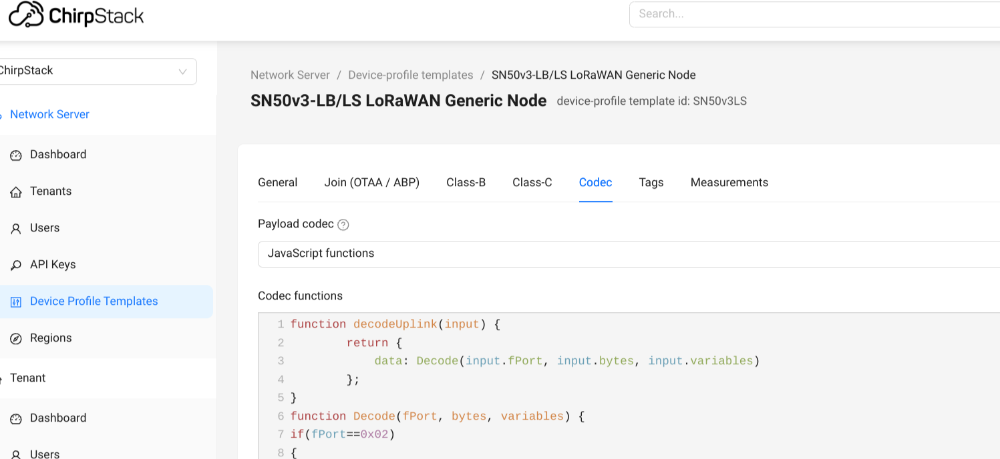

Définissez ensuite une "Gateway". Vous aurez a renseigner le code EUI64 de l'émetteur qui figure sur son étiquette

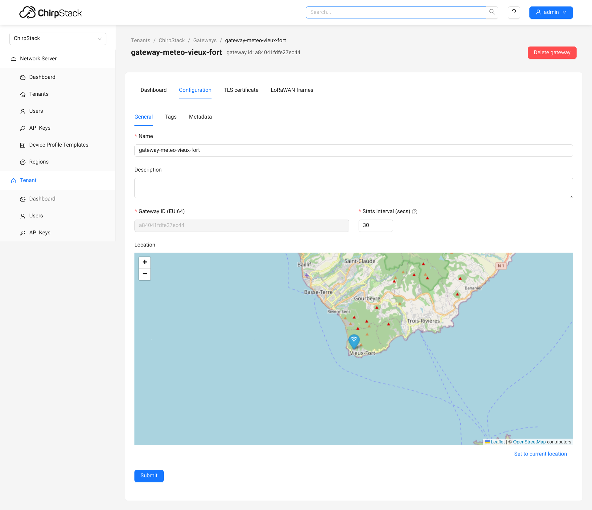

Enfin vous aurez a définir une "application", qui fait le lien entre la gateway et le device

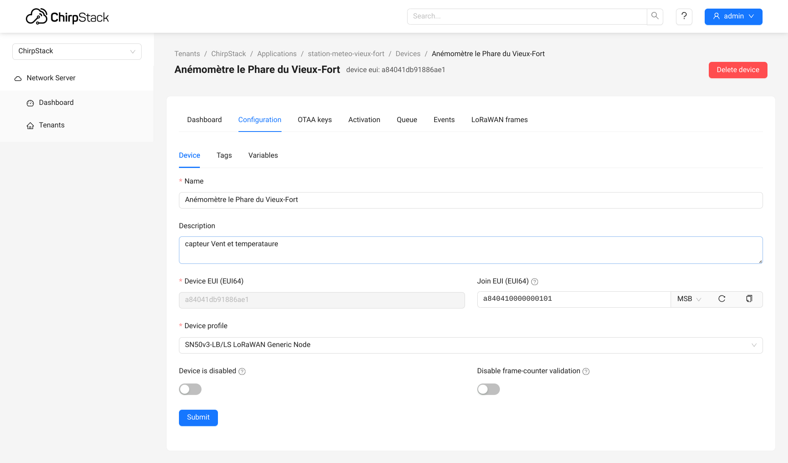

A ce stade, vous devez pouvoir visualiser les événements décodés qui proviennent de l'émetteur

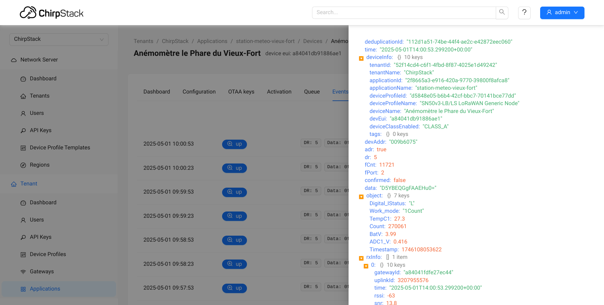

Pour la suite de la configuration, il était prévu de sauvegarder les événements dans une base locale pour ensuite les traiter et les transmettre aux services tiers (Windguru) et pour cela j'ai essayé de mettre en œuvre une "integration" de type "InfluxDB"

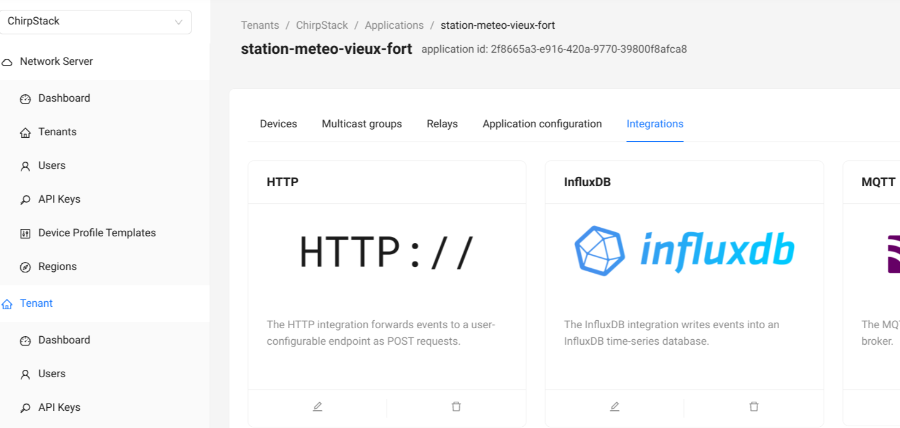

Néanmoins, je ne suis pas parvenu à faire fonctionner ce connecteur. La mise en œuvre a par la suite été centralisée dans un 3e outil : Node-Red

### InfluxDB

La base conseillée par Dragino n'est pas installée par défaut. Pour l'installer, connectez-vous par SSH a l'IP de la passerelle puis exécutez les commandes suivantes :

```
curl https://repos.influxdata.com/influxdata-archive_compat.key | gpg --dearmor | sudo tee /usr/share/keyrings/influxdb-archive-keyring.gpg >/dev/null
echo "deb [signed-by=/usr/share/keyrings/influxdb-archive-keyring.gpg] https://repos.influxdata.com/debian $(lsb_release -cs) stable" | sudo tee /etc/apt/sources.list.d/influxdb.list
apt update && apt install influxdb
systemclt enable influxdb
systemctl start influxdb
```

Vérifiez ensuite que la base est demarrée avec la commande "systemctl status influxdb"

## Node Red

Node Red est un outil de programmation visuelle (low-code) embarqué dans la passerelle Dragino. Il est disponible à l'adresse http://192.168.1.20:1880

Les mesures des capteurs sont disponibles sur la queue MQTT locale à la passerelle Dragino

Dans RedNode nous allons traiter 2 flux de données :

* Un premier "stream" qui stocke toutes les mesures reçues sur la queue MQTT dans la base InfluxDB
* Un deuxième "stream" qui s'exécute toutes les minutes et qui traite les mesures reçues pendant les 5 dernières minutes afin de les transformer puis de les transmettre a OpenWindMap et WindGuru

Voici comment se présente les 2 streams dans Node Red :

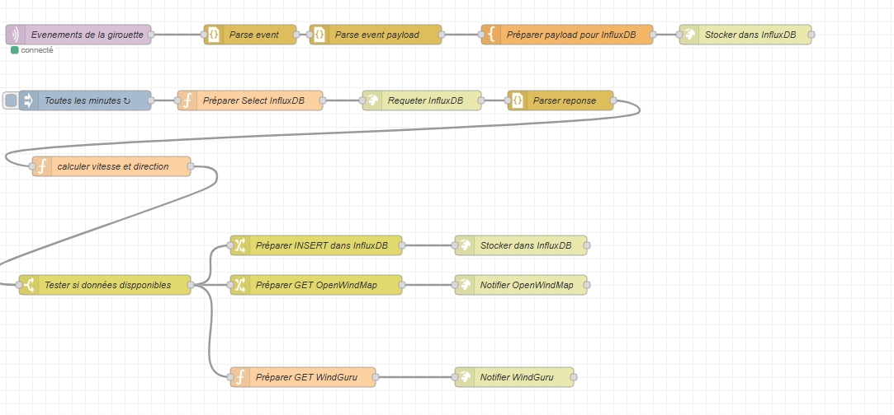

### Stockage des événements

Le flux démarre par un noeud MQTT-IN. Le "topic" est "application/+/device/+/event/+"

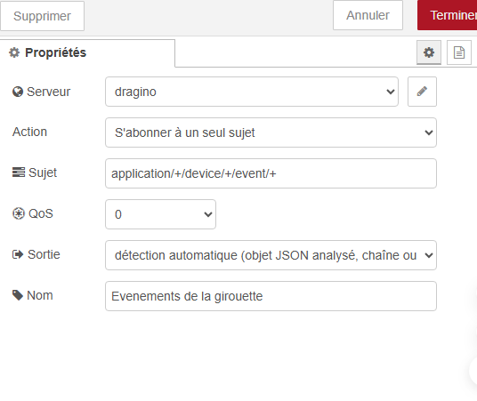

Le format de l'événement est assez particulier. C'est une chaine Json encapsulée dans un autre objet Json. Il faut donc le décoder en 2 étapes. C'est ce qui explique les 2 noeuds "parse event" en cascade

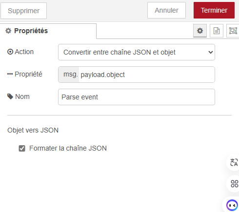  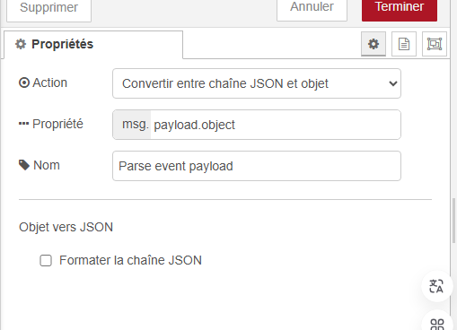

On prépare alors l'insertion dans InfluxDB, via son API HTTP

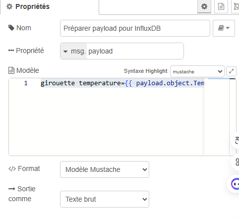

```
girouette temperature={{ payload.object.TempC1 }},batterie={{ payload.object.BatV }},rotations={{ payload.object.Count }},voltage={{ payload.object.ADC1_V }} {{ payload.object.Timestamp }}
```

Enfin on insere l'événement dans InfluxDB

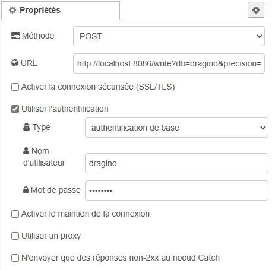

### Traitement des événements

Le premier nœud est un scheduler Node Red qui diffuse un événement toutes les minutes.

Nous allons enrichir cet événement avec la liste des mesures recueillies pendant les 5 dernières minutes

TODO : détailler requete et reponse InfluxDB

Les mesures sont disponibles, nous pouvons maintenant calculer les métriques finales selon ces règles :

* Les vitesses en km/h seront données par la formule suivante :  V = P*(2.25*1.60934/T) avec P le nombre de rotations entre 2 points de mesure et T le temps en secondes entre ces 2 mesures (formule adaptée de la documentation DAVIS 6410)
* La vitesse moyenne est obtenue en prenant en compte les 2 points de mesure les plus éloignés sur la période de 5 minutes.
* Les vitesses min et max sont obtenues entre 2 points de mesures consécutifs  (éloignés de 30 secondes) sur la période de 5 minutes.
* La direction du vent en degrés par rapport au nord est donnée par la formule suivante : y = modulo(395,1932806 *x - 59,62030662 + Cal, 360), ou x est la mesure en volts du boitier (entre 0.1 et 1V environ) et Cal est la direction du support girouette par rapport au nord (Si on pointe le support girouette vers le nord alors Cal = 0 si tu pointe l’EST Cal = 90, le sud Cal = 180 et l’ouest  Cal = 270).
la formule donnant la direction du vent en degrés a été obtenue en effectuant une calibration de la girouette connectée au boitier : pour différente position de la girouette on mesure la tension du potentiomètre et la valeur renvoyée par l’ADC du boitier puis on passe une droite de régression a*x+b. si un autre modèle de girouette est  utilisé  ou si un  autre pont de résistance est mis en œuvre, la calibration est à refaire


Le code figurant dans le noeud fonction "calculer vitesse et direction" est donc :

```
var values = msg.payload.results[0].series[0].values
var rotations_reset = 0
var sum_voltage = 0

var payload = {}
payload.min_time = 0
payload.start_rotations = 0
payload.end_rotations = 0
payload.vitesse_min_kmh = 1000000
payload.vitesse_max_kmh = 0

var voltage = 0
payload.count = values.length
msg.payload = payload
if (payload.count < 2)
    return msg;
for (let value of values)  {
    if (payload.min_time == 0) payload.min_time = value[0]
    if (payload.start_rotations == 0) payload.start_rotations = value[3]
    payload.temperature = value[1]
    payload.batterie = value[2]
    sum_voltage = sum_voltage + value[4]
    if (value[3] < payload.end_rotations) 
        rotations_reset = payload.end_rotations
    
    var pulse = value[3] + rotations_reset - payload.end_rotations
    if (payload.max_time > 0) {
        var vitesse_inst_kmh = pulse * 2.25 *  1.60934 * 1000 / (value[0] - payload.max_time)
        if (vitesse_inst_kmh > payload.vitesse_max_kmh)
            payload.vitesse_max_kmh = vitesse_inst_kmh 
        if (vitesse_inst_kmh < payload.vitesse_min_kmh)
            payload.vitesse_min_kmh = vitesse_inst_kmh
    }
    
    payload.end_rotations = value[3] + rotations_reset
    payload.max_time = value[0]
}
// calcul de la direction du vent
var avg_angle = 0
if (payload.count > 0)
    voltage = sum_voltage / payload.count
payload.angle = (395.1932806 * voltage - 59.62030662 + 180) % 360
// calcul de la vitesse
payload.secondes = (payload.max_time - payload.min_time) /1000
payload.pulse = payload.end_rotations - payload.start_rotations
payload.vitesse_kmh = payload.pulse * 2.25 *  1.60934 / payload.secondes 
payload.vitesse_ms = payload.vitesse_kmh / 3.6
payload.vitesse_max_ms = payload.vitesse_max_kmh / 3.6
payload.vitesse_min_ms = payload.vitesse_min_kmh / 3.6
return msg;
```

Un test, utilisant un noeud redNode de type "switch" est mis en place pour arrêter le traitement si on n'a pas trouvé au moins 2 mesures sur la période de 5 minutes

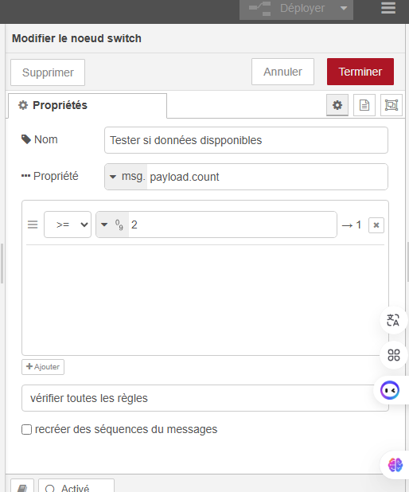

On prépare l'appel a l'API OpenWindMap

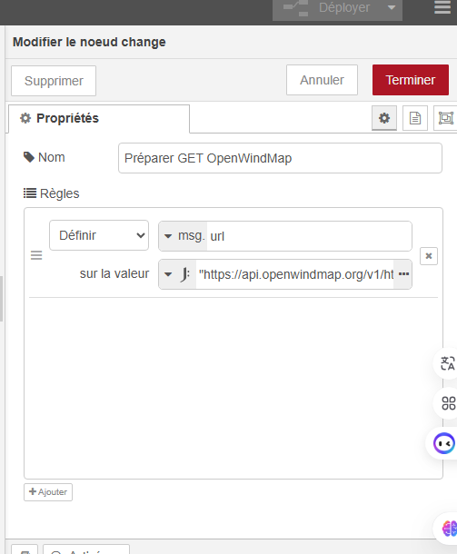

```
"https://api.openwindmap.org/v1/http-receive/1227?key=**************&avg=" & payload.vitesse_kmh & "&heading=" & payload.angle & "&voltage=" & payload.batterie & "&temperature=" & payload.temperature & "&date=" & payload.max_time & "&min=" & payload.vitesse_min_kmh & "&max=" & payload.vitesse_max_kmh
```

La préparation de l'appel a l'API Windguru est un peu plus complexe car on doit calculer un MD5. Une fonction autonome permettant de calculer des MD5 est embarquée dans notre code.

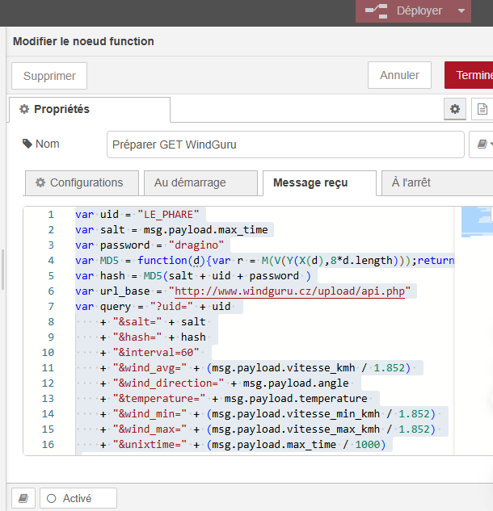

```
var uid = "LE_PHARE"
var salt = msg.payload.max_time
var password = "*******"
var MD5 = function(d){var r = M(V(Y(X(d),8*d.length)));return r.toLowerCase()};function M(d){for(var _,m="0123456789ABCDEF",f="",r=0;r<d.length;r++)_=d.charCodeAt(r),f+=m.charAt(_>>>4&15)+m.charAt(15&_);return f}function X(d){for(var _=Array(d.length>>2),m=0;m<_.length;m++)_[m]=0;for(m=0;m<8*d.length;m+=8)_[m>>5]|=(255&d.charCodeAt(m/8))<<m%32;return _}function V(d){for(var _="",m=0;m<32*d.length;m+=8)_+=String.fromCharCode(d[m>>5]>>>m%32&255);return _}function Y(d,_){d[_>>5]|=128<<_%32,d[14+(_+64>>>9<<4)]=_;for(var m=1732584193,f=-271733879,r=-1732584194,i=271733878,n=0;n<d.length;n+=16){var h=m,t=f,g=r,e=i;f=md5_ii(f=md5_ii(f=md5_ii(f=md5_ii(f=md5_hh(f=md5_hh(f=md5_hh(f=md5_hh(f=md5_gg(f=md5_gg(f=md5_gg(f=md5_gg(f=md5_ff(f=md5_ff(f=md5_ff(f=md5_ff(f,r=md5_ff(r,i=md5_ff(i,m=md5_ff(m,f,r,i,d[n+0],7,-680876936),f,r,d[n+1],12,-389564586),m,f,d[n+2],17,606105819),i,m,d[n+3],22,-1044525330),r=md5_ff(r,i=md5_ff(i,m=md5_ff(m,f,r,i,d[n+4],7,-176418897),f,r,d[n+5],12,1200080426),m,f,d[n+6],17,-1473231341),i,m,d[n+7],22,-45705983),r=md5_ff(r,i=md5_ff(i,m=md5_ff(m,f,r,i,d[n+8],7,1770035416),f,r,d[n+9],12,-1958414417),m,f,d[n+10],17,-42063),i,m,d[n+11],22,-1990404162),r=md5_ff(r,i=md5_ff(i,m=md5_ff(m,f,r,i,d[n+12],7,1804603682),f,r,d[n+13],12,-40341101),m,f,d[n+14],17,-1502002290),i,m,d[n+15],22,1236535329),r=md5_gg(r,i=md5_gg(i,m=md5_gg(m,f,r,i,d[n+1],5,-165796510),f,r,d[n+6],9,-1069501632),m,f,d[n+11],14,643717713),i,m,d[n+0],20,-373897302),r=md5_gg(r,i=md5_gg(i,m=md5_gg(m,f,r,i,d[n+5],5,-701558691),f,r,d[n+10],9,38016083),m,f,d[n+15],14,-660478335),i,m,d[n+4],20,-405537848),r=md5_gg(r,i=md5_gg(i,m=md5_gg(m,f,r,i,d[n+9],5,568446438),f,r,d[n+14],9,-1019803690),m,f,d[n+3],14,-187363961),i,m,d[n+8],20,1163531501),r=md5_gg(r,i=md5_gg(i,m=md5_gg(m,f,r,i,d[n+13],5,-1444681467),f,r,d[n+2],9,-51403784),m,f,d[n+7],14,1735328473),i,m,d[n+12],20,-1926607734),r=md5_hh(r,i=md5_hh(i,m=md5_hh(m,f,r,i,d[n+5],4,-378558),f,r,d[n+8],11,-2022574463),m,f,d[n+11],16,1839030562),i,m,d[n+14],23,-35309556),r=md5_hh(r,i=md5_hh(i,m=md5_hh(m,f,r,i,d[n+1],4,-1530992060),f,r,d[n+4],11,1272893353),m,f,d[n+7],16,-155497632),i,m,d[n+10],23,-1094730640),r=md5_hh(r,i=md5_hh(i,m=md5_hh(m,f,r,i,d[n+13],4,681279174),f,r,d[n+0],11,-358537222),m,f,d[n+3],16,-722521979),i,m,d[n+6],23,76029189),r=md5_hh(r,i=md5_hh(i,m=md5_hh(m,f,r,i,d[n+9],4,-640364487),f,r,d[n+12],11,-421815835),m,f,d[n+15],16,530742520),i,m,d[n+2],23,-995338651),r=md5_ii(r,i=md5_ii(i,m=md5_ii(m,f,r,i,d[n+0],6,-198630844),f,r,d[n+7],10,1126891415),m,f,d[n+14],15,-1416354905),i,m,d[n+5],21,-57434055),r=md5_ii(r,i=md5_ii(i,m=md5_ii(m,f,r,i,d[n+12],6,1700485571),f,r,d[n+3],10,-1894986606),m,f,d[n+10],15,-1051523),i,m,d[n+1],21,-2054922799),r=md5_ii(r,i=md5_ii(i,m=md5_ii(m,f,r,i,d[n+8],6,1873313359),f,r,d[n+15],10,-30611744),m,f,d[n+6],15,-1560198380),i,m,d[n+13],21,1309151649),r=md5_ii(r,i=md5_ii(i,m=md5_ii(m,f,r,i,d[n+4],6,-145523070),f,r,d[n+11],10,-1120210379),m,f,d[n+2],15,718787259),i,m,d[n+9],21,-343485551),m=safe_add(m,h),f=safe_add(f,t),r=safe_add(r,g),i=safe_add(i,e)}return Array(m,f,r,i)}function md5_cmn(d,_,m,f,r,i){return safe_add(bit_rol(safe_add(safe_add(_,d),safe_add(f,i)),r),m)}function md5_ff(d,_,m,f,r,i,n){return md5_cmn(_&m|~_&f,d,_,r,i,n)}function md5_gg(d,_,m,f,r,i,n){return md5_cmn(_&f|m&~f,d,_,r,i,n)}function md5_hh(d,_,m,f,r,i,n){return md5_cmn(_^m^f,d,_,r,i,n)}function md5_ii(d,_,m,f,r,i,n){return md5_cmn(m^(_|~f),d,_,r,i,n)}function safe_add(d,_){var m=(65535&d)+(65535&_);return(d>>16)+(_>>16)+(m>>16)<<16|65535&m}function bit_rol(d,_){return d<<_|d>>>32-_}
var hash = MD5(salt + uid + password )
var url_base = "http://www.windguru.cz/upload/api.php"
var query = "?uid=" + uid 
    + "&salt=" + salt 
    + "&hash=" + hash 
    + "&interval=60" 
    + "&wind_avg=" + (msg.payload.vitesse_kmh / 1.852) 
    + "&wind_direction=" + msg.payload.angle 
    + "&temperature=" + msg.payload.temperature 
    + "&wind_min=" + (msg.payload.vitesse_min_kmh / 1.852) 
    + "&wind_max=" + (msg.payload.vitesse_max_kmh / 1.852) 
    + "&unixtime=" + (msg.payload.max_time / 1000)

msg.url = url_base + query
return msg;
```
## Quelques images 

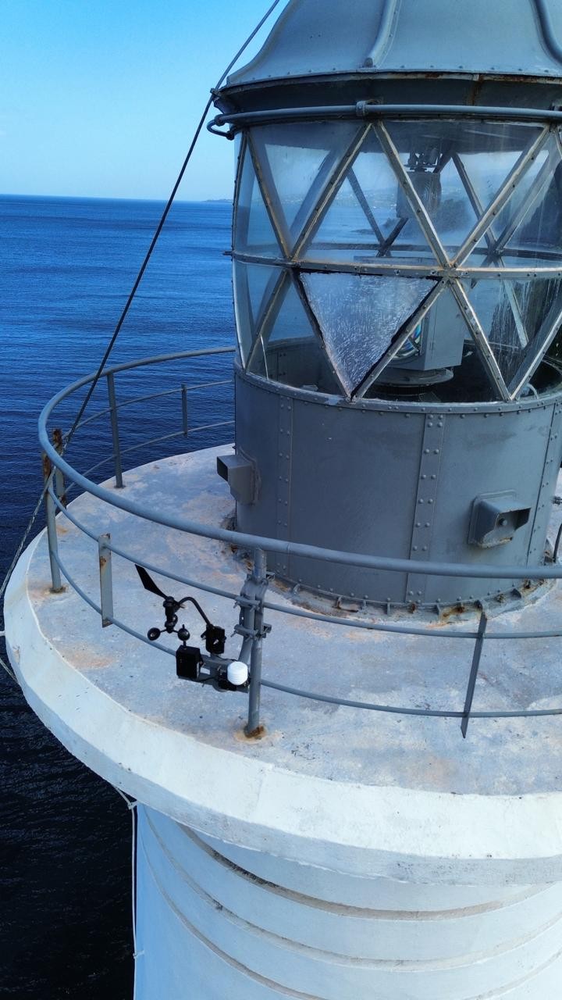

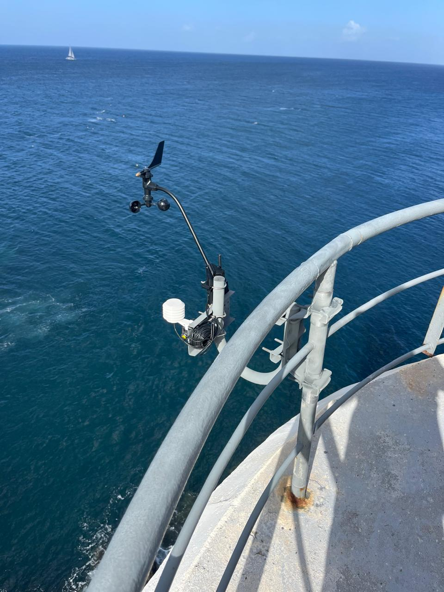

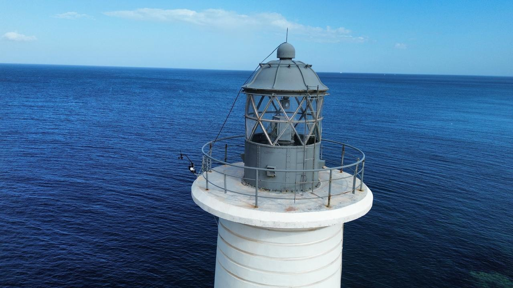
